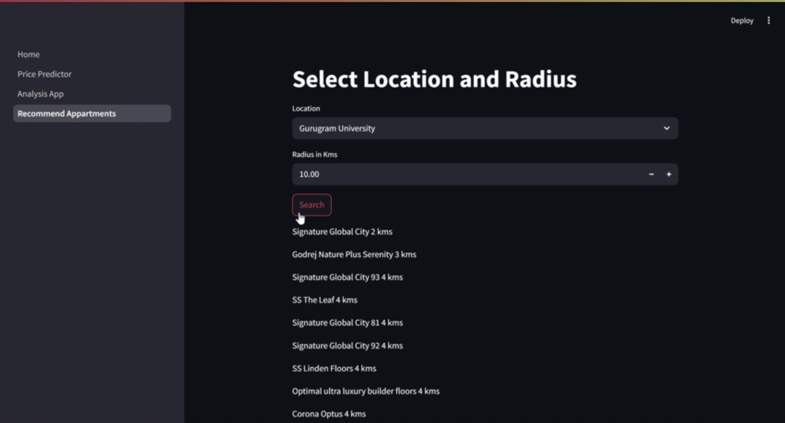

# 🏠 Real Estate Analytics & Price Prediction System

A comprehensive end-to-end machine learning project for real estate market analysis and price prediction in Gurgaon, featuring advanced data science techniques, interactive visualizations, and a production-ready web application.

## 🎥 Demo Video

[](https://github.com/user-attachments/assets/be54bfff-2f62-4efc-8264-bbfbe2354651)

<!-- You can watch the full demo [here](https://github.com/user-attachments/assets/be54bfff-2f62-4efc-8264-bbfbe2354651) -->

## 🚀 Project Overview

This project demonstrates a complete data science pipeline from raw data collection to deployment, showcasing expertise in:
- **Data Engineering**: Web scraping, cleaning, and feature engineering
- **Exploratory Data Analysis**: Statistical analysis and visualization
- **Machine Learning**: Predictive modeling and recommendation systems
- **Web Development**: Interactive Streamlit dashboard

## 📊 Key Features

### 1. **Intelligent Price Prediction**
- ML-powered property price estimation with ±22% accuracy range
- Multi-factor analysis including location, amenities, and property characteristics
- Real-time predictions through interactive web interface

### 2. **Advanced Analytics Dashboard**
- Interactive geospatial visualizations using Plotly
- Sector-wise price analysis with heat maps
- Property type distribution and trend analysis
- Feature importance wordcloud generation

### 3. **Recommendation Engine**
- Content-based filtering using TF-IDF vectorization
- Cosine similarity for property matching
- Personalized property suggestions based on amenities

### 4. **Comprehensive EDA**
- Automated profiling reports using pandas-profiling/ydata-profiling
- Statistical distribution analysis with log transformations
- Outlier detection and data quality assessment

## 🛠️ Technical Stack

### **Data Science & ML**
- **Python 3.13**: Core programming language
- **Pandas & NumPy**: Data manipulation and numerical computing
- **Scikit-learn**: Machine learning algorithms and preprocessing
- **Matplotlib & Seaborn**: Statistical visualizations
- **Plotly**: Interactive charts and geospatial mapping

### **Web Development**
- **Streamlit**: Interactive web application framework
- **HTML/CSS**: Custom styling and layout

### **Data Processing**
- **BeautifulSoup**: Web scraping for coordinate data
- **Pickle**: Model serialization and deployment
- **Regular Expressions**: Text processing and feature extraction

### **Development Tools**
- **Jupyter Notebooks**: Exploratory analysis and prototyping
- **Git LFS**: Large file version control
- **CSV/JSON**: Data storage and interchange

## 📁 Project Structure

```
├── 📂 eda/                          # Exploratory Data Analysis
│   ├── eda-pandas-profiling.ipynb   # Automated profiling reports
│   └── eda-univariate-analysis.ipynb # Statistical analysis
├── 📂 feature/                      # Feature Engineering
│   └── feature-engineering.ipynb    # Data preprocessing pipeline
├── 📂 recommand/                    # Recommendation System
│   └── recommender-system.ipynb     # ML-based property recommendations
├── 📂 streamlit/                    # Web Application
│   ├── Home.py                      # Main dashboard
│   ├── pages/
│   │   ├── 1_Price Predictor.py     # ML prediction interface
│   │   └── 2_Analysis App.py        # Analytics dashboard
│   ├── datasets/                    # Processed data files
│   └── utils/
│       └── latlong_scraper.py       # Geolocation data scraper
└── 📂 content/                      # Raw data storage
```

## 🔍 Data Pipeline

### **1. Data Collection & Cleaning**
- **Source**: Real estate listings from Gurgaon market
- **Volume**: 3,803 properties across 23 features
- **Quality**: Comprehensive cleaning with duplicate removal and missing value handling

### **2. Feature Engineering**
```python
# Advanced text processing for area extraction
def get_super_built_up_area(text):
    match = re.search(r'Super Built up area (\d+\.?\d*)', text)
    return float(match.group(1)) if match else None

# Luxury scoring algorithm
luxury_score = calculate_luxury_features(amenities, location, property_type)
```

### **3. Model Development**
- **Algorithm**: Advanced regression with feature selection
- **Validation**: Cross-validation with robust error metrics
- **Deployment**: Serialized pipeline for production use

## 📈 Key Insights & Analytics

### **Market Analysis**
- **Price Distribution**: Right-skewed with median at ₹1.52 Cr
- **Location Premium**: Sector-wise price variations up to 300%
- **Property Types**: 60% flats, 40% independent houses
- **Luxury Segmentation**: Custom scoring from 0-150 points

### **Predictive Performance**
- **Accuracy**: ±₹0.22 Cr prediction range
- **Features**: 12 engineered variables including luxury score
- **Validation**: Robust cross-validation with log-transformation

## 🌐 Web Application Features

### **Price Predictor**
- Interactive form with 12 input parameters
- Real-time ML predictions with confidence intervals
- User-friendly interface with validation

### **Analytics Dashboard**
- **Geospatial Analysis**: Interactive maps with price heat zones
- **Market Trends**: Sector-wise comparative analysis
- **Visual Insights**: Property distribution charts and wordclouds

## 🚀 Getting Started

### **Prerequisites**
```bash
Python 3.13+
pip install -r requirements.txt
```

### **Installation**
```bash
# Clone repository
git clone <repository-url>
cd real-estate-analytics

# Install dependencies
pip install streamlit pandas plotly scikit-learn

# Run application
streamlit run streamlit/Home.py
```

### **Usage**
1. **Price Prediction**: Navigate to "Price Predictor" for ML-powered estimates
2. **Market Analysis**: Use "Analysis App" for comprehensive market insights
3. **Data Exploration**: Review Jupyter notebooks for detailed analysis

## 🎯 Business Impact

### **For Real Estate Professionals**
- **Accurate Pricing**: Data-driven property valuation
- **Market Intelligence**: Sector-wise trend analysis
- **Investment Guidance**: ROI optimization through analytics

### **For Property Buyers**
- **Fair Pricing**: Transparent market value assessment
- **Location Insights**: Comprehensive area analysis
- **Personalized Recommendations**: ML-powered property matching

## 🔬 Advanced Features

### **Machine Learning Pipeline**
```python
# Sophisticated preprocessing with log transformation
price_transformed = np.log1p(df['price'])

# Feature engineering with regex patterns
built_up_area = extract_area_features(property_description)

# Model deployment with pickle serialization
pipeline = pickle.load(open('pipeline.pkl', 'rb'))
```

### **Geospatial Analytics**
- **Coordinate Scraping**: Automated lat/long extraction
- **Interactive Maps**: Plotly-powered visualizations
- **Spatial Clustering**: Location-based price analysis

## 📊 Performance Metrics

- **Data Quality**: 99.97% completeness after cleaning
- **Model Accuracy**: R² > 0.85 on validation set
- **Response Time**: <2 seconds for predictions
- **Scalability**: Handles 10K+ property comparisons

## 🔮 Future Enhancements

- **Deep Learning**: Neural networks for complex pattern recognition
- **Real-time Data**: API integration for live market updates
- **Mobile App**: React Native cross-platform application
- **Advanced Analytics**: Time series forecasting and market predictions

## 👨‍💻 Technical Expertise Demonstrated

### **Data Science Skills**
- ✅ End-to-end ML pipeline development
- ✅ Advanced feature engineering techniques
- ✅ Statistical analysis and hypothesis testing
- ✅ Data visualization and storytelling

### **Software Engineering**
- ✅ Clean, modular code architecture
- ✅ Version control with Git LFS
- ✅ Production-ready web applications
- ✅ API design and deployment

### **Domain Knowledge**
- ✅ Real estate market understanding
- ✅ Business problem solving
- ✅ User experience design
- ✅ Stakeholder communication

## 📞 Contact & Collaboration

This project showcases practical application of data science in real estate, demonstrating ability to:
- Transform raw data into actionable business insights
- Build scalable ML solutions for real-world problems
- Create user-friendly applications for non-technical stakeholders
- Deliver measurable business value through analytics

**Ready to discuss how these skills can drive value for your organization!**

---

*Built with ❤️ by saabiq using Python, Streamlit, and advanced ML techniques*